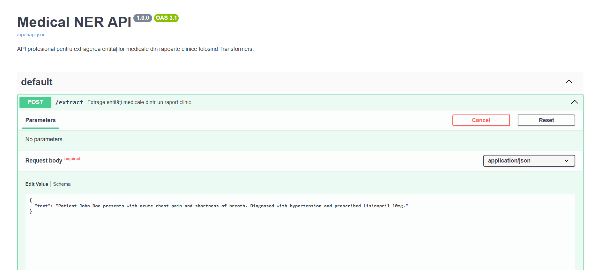
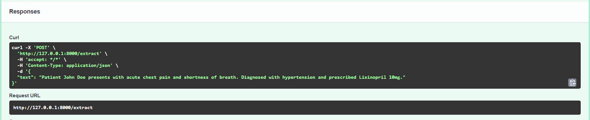
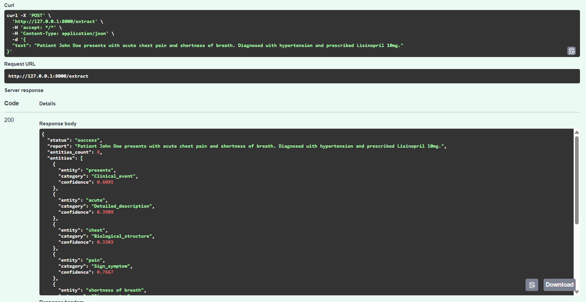

# Medical NER Pipeline & FastAPI Service

A Medical Named Entity Recognition (NER) pipeline built in Python, leveraging state-of-the-art Hugging Face Transformer models and exposing a high-performance web service via FastAPI.

## Architecture & Technologies
- **Language:** Python 3.10+
- **NLP / Machine Learning:** Hugging Face Transformers (\`Helios9/BioMed_NER\`), PyTorch
- **Web API:** FastAPI, Uvicorn, Pydantic
- **Post-processing:** Custom sub-word and adjacent entity merging algorithm based on character coordinates.

## Project Structure
- \`api.py\` - FastAPI web server and entity post-processing logic.
- \`medical_ner.py\` - Core script for running inference via command line.
- \`requirements.txt\` - Project dependencies.
- \`.gitignore\` - Excluded files for version control.

## Installation & Local Run

1. **Clone the repository:**
   \`\`\`bash
   git clone https://github.com/MasterWise23/medical-nlp-ner-pipeline.git
   cd medical-nlp-ner-pipeline
   \`\`\`

2. **Create and activate virtual environment:**
   \`\`\`bash
   python -m venv .venv
   .\\.venv\\Scripts\\Activate.ps1
   \`\`\`

3. **Install dependencies:**
   \`\`\`bash
   pip install -r requirements.txt
   \`\`\`

4. **Start the API server:**
   \`\`\`bash
   uvicorn api:app --reload
   \`\`\`

5. **Testing:**
   Access the interactive Swagger UI documentation at: **http://127.0.0.1:8000/docs**

   ## Screenshots & Demo

### 1. Interactive Swagger UI
The FastAPI interface ready for testing POST requests with clinical reports:

### 2. Request & cURL Generation
Visualization of request details and the cURL command generated directly from the interactive documentation:

### 3. Response
Visualization of the JSON response body containing extracted medical entities, categories, and confidence scores:

